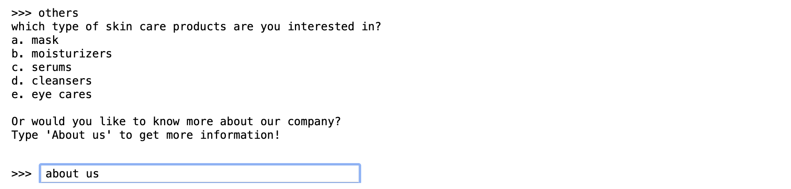

## Skin Care Recomendation Chatbot
Meet my chatbot, Vivi! She will give you the best recommendation of skin care from JY-II.

# First, she would like to know your name!

# Now, tell her what products you are interested in!

When answering, users might enter with, OR without a '.'(for example: 'a.' or just 'a'). Additionally, some might even type in the name of the product(for example: 'mask').
That's why when we are writing the regex for this part, we need to enter all kind of possiblities, like symbols or capitalized letters etc.

# Time for some details
Here you can choose between knowing more about the product, or just ask for recommendation for other products.

For users who want to get to know the company better, they can ask for it here!

# Deal with random answers

Sometimes users might enter random answer, so we have to also create a reply and a clear guide to bring them back!

I hope you like my little chatbot and her recommendation!
